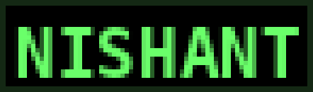

<!-- Retro Terminal Header -->
<div align="center">
  
</div>


<!-- Typing Intro -->
<div align="center">
  +nishant.exe+initializing...;Cross-Platform+Developer;Web+%2F+Mobile+%2F+Desktop;MERN+%7C+Next.js+%7C+Nest.js+%7C+Flutter+%7C+Rust+%2B+Tauri" />
</div>

<p align="center">
  
</p>

---

```bash
> whoami
```

**Nishant** — I build **cross-platform applications** across **Web**, **Mobile**, and **Desktop**.  
I focus on **clean UI**, **high-performance systems**, and **developer-friendly codebases**.

Working with:

- **JavaScript → TypeScript → Rust**
- **MERN → Next.js → Nest.js → Flutter → Tauri**

---

```bash
> system status: skills --list
```

### 🧠 **Languages**


### 🎨 **Frontend**


### ⚙️ **Backend & APIs**


### 📱 **Mobile / Cross-Platform**


-7CFF6B?style=for-the-badge&logo=android&logoColor=000)


### 🗄️ **Database & Cloud**


### 🧰 **Tools**


---

```bash
> projects --featured
```

| Project                                                                       | Description                                                            | Stack                      |
| ----------------------------------------------------------------------------- | ---------------------------------------------------------------------- | -------------------------- |
| **[Offbeat Pravasi v2](https://github.com/const-nishant/offbeat_pravasi_v2)** | Trek & travel experience platform with real-time features & modern UI. | Flutter + Appwrite + Firebase |
| **[Rustium-CLI](https://github.com/const-nishant/Rustium-CLI)**               | Command-line tool built fast & minimal in Rust.           | Rust + Clap + Tokio        |

---

```bash
> github activity
```

<div align="center">

  


  

</div>


---

```bash
> socials --open
```

<div align="center">
  <a href="https://www.linkedin.com/in/const-nishant"></a>
  <a href="https://www.instagram.com/const_nishant"></a>
</div>

---

```bash
> exit
```

```


                 -----------!-----------
-----------!-----------  /=====\
          |===\_________/_  o  |
         /_]    o o  o o____   /
        <_]___[]_______<____>/
            o              o

       const-nishant • cross-platform dev

```

<div align="center">
  
</div>
